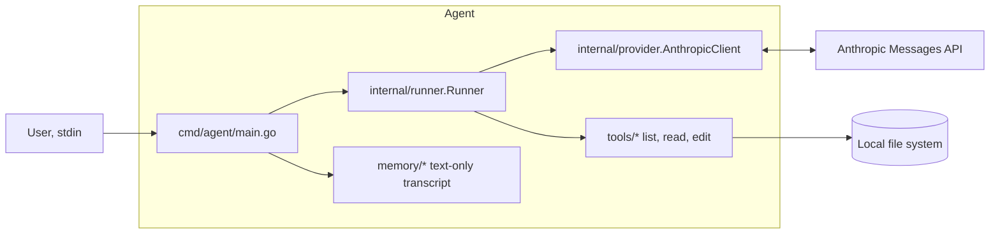

# Go Agent

A lean, extensible, language‑model–backed Go agent that can call simple tools to list, read, and edit files. Uses Anthropic’s Messages API by default.

## Current scope (alpha/experimental):

- Basic chat loop
- File tools: `list_files`, `read_file`, `edit_file`
- Persistence: minimal text‑only conversation history
- Provider: Anthropic Messages API (default)
- Model: `claude-3-7-sonnet-latest` (default; can be changed in internal/provider/anthropic.go)

### Tools

- `list_files`: Lists files in current directory (non-recursive)
- `read_file`: Reads a specified text file
- `edit_file`: Edits file content, or creates new file if it doesn't exist; no sandboxing yet (see Safety)

## Quick start

### Setup:

- Go 1.24+

- Clone the repository:
```bash
git clone https://github.com/petasbytes/go-agent.git
cd go-agent
```

- Set API key:
```bash
export ANTHROPIC_API_KEY=sk-ant-...
```

### Run:

```bash
make run                               # or: go run ./cmd/agent
```

### Build:

```bash
make build                             # or: go build -o bin/agent ./cmd/agent
```

### Test:

```bash
make test                              # or: go test ./... -count=1
```
*(current testing scope: tools, registry, memory)*

### Coverage:

```bash
make cover                             # or: go test ./... -count=1 -cover | tail -n 1
make cover-html                        # HTML report for local viewing
```

### Usage example

#### List files:
```
You: hi there, please list all files in the current directory, thanks mate
Claude: I'll list all the files in the current directory for you.
Claude: Here are all the files and directories in the current directory:

- .envrc
- .git/ (directory)
- .gitignore
- LICENSE
- Makefile
- cmd/ (directory)
- go.mod
- go.sum
- internal/ (directory)
- memory/ (directory)
- nothingtoseehere.txt
- tools/ (directory)
- veryinterestingfile.txt
- whatonearthisinthisfile.txt

Let me know if you need anything else!
```

#### Create file:
```
You: actually can you make a file called superimportantfile.txt?
Claude: I'll create a new file called "superimportantfile.txt" for you.

To create a new file, I'll use the edit_file function with an empty old_str (since the file doesn't exist yet) and provide the initial content for the file.
Claude: I've successfully created the file "superimportantfile.txt" with the initial content "This is a new super important file."

Is there anything specific you'd like to add to this file or any other changes you need?
```

#### Read file:
```
You: okay thanks, now can you please read that same file?     
Claude: I'll read the superimportantfile.txt file for you.
Claude: Here's the content of superimportantfile.txt:

"This is a new super important file."
You: awesome, thanks mate
Claude: You're welcome! Glad I could help with creating and reading the superimportantfile.txt file. If you need any other assistance with file operations or anything else, just let me know. Have a great day!
```
___

## Project layout

- `cmd/agent/` — CLI entrypoint and wiring
- `internal/provider/` — Anthropic client wrapper and `DefaultModel`
- `internal/runner/` — message send loop and tool dispatch
- `tools/` — `ToolDefinition`, JSON‑schema helper, and file tools
- `memory/` — JSON persistence for text‑only messages

## Architecture



### Current design choices

- Minimal, explicit tool registry (tools/registry.go)
- Text-only persistence for simplicity (memory/conversation.go)
- Centralised provider and model selection (internal/provider/)

## Safety

- Warning: Currently the `edit_file` tool writes without sandboxing; run the agent in a disposable/sandbox directory.
- Path safety and write policy to be added (see Scope & Roadmap).

## Troubleshooting

- 401/403 from API: Ensure `ANTHROPIC_API_KEY` is set and valid.
- Network/proxy errors: Retry `make run` or check your proxy/firewall.
- 429 (rate limit): Wait and retry; this project is single-attempt by default (retries yet to be added).

---

## Roadmap

Planned:

- Path safety and write policy (sandbox roots)
- Pair-safe windowing and heuristic token counter
- Near-budget token counting; optional retries/limits

## Other references:

- Anthropic Messages: https://docs.anthropic.com/en/api/messages
- Tool use: https://docs.anthropic.com/en/docs/build-with-claude/tool-use

## License

See `LICENSE` in this repository.

## Acknowledgements

- Inspired by “How to Build an Agent” (AmpCode): https://ampcode.com/how-to-build-an-agent
- Portions of tools/edit_file.go were adapted from the article. Changes include package modularisation, input descriptions, tool definition and wiring.
