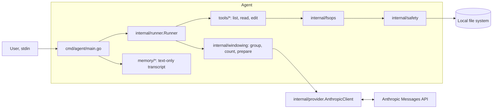

# Go Agent

A lean, extensible, language‑model–backed Go agent that can call simple tools to list, read, and edit files. Uses Anthropic’s Messages API by default.

## Current scope (alpha/experimental):

- Basic chat loop
- File tools: `list_files`, `read_file`, `edit_file`
- Persistence: JSON text‑only conversation history
- Provider: Anthropic Messages API (default)
- Model: `claude-3-7-sonnet-latest` (default; can be changed in internal/provider/anthropic.go)

### Tools

- `list_files`: Optional relative directory path within the sandbox (defaults to current directory). Supports paging parameters `page` (default 1) and `page_size` (default 200). Returns a JSON-encoded `[]string`; entries are deterministically sorted; directories are suffixed with `/`. Enforced by path validation and read denylist.
- `read_file`: Relative file path within the sandbox; supports `offset` (0-based line) and `limit` (default 200 lines). Applies a per-line clamp and an overall rune cap; when paginated or truncated, appends a trailing sentinel `-- truncated; use offset/limit to fetch more --\n`. Enforced by path validation and read denylist.
- `edit_file`: Relative file path within the sandbox; enforced by path validation and write policy. Returns `OK` on successful edit; creating a new file returns a descriptive non-empty confirmation.

## Quick start

### Setup:

- Go 1.24+

- Clone the repository:
```bash
git clone https://github.com/petasbytes/go-agent.git
cd go-agent
```

- Set required environment variables:
```bash
export ANTHROPIC_API_KEY=sk-ant-...
export AGT_TOKEN_BUDGET=16000   # input-window budget (currently rune-based; see "Context windowing" below).
```

### Run:

```bash
make run                               # or: go run ./cmd/agent
```

By default, the Makefile runs the agent from a dedicated `./sandbox` directory (via a subshell `cd`). This keeps file operations contained during development.

Note (development): The agent stores conversation state under `.agent/` in the current working directory (e.g., `sandbox/.agent/`). This directory is gitignored and can be safely deleted to reset state.

Optional: override sandbox roots (only if you aren't using the Makefile or want a different directory; by default the current working directory is used, and `make run` runs inside `./sandbox`):

```bash
export AGT_READ_ROOT="./my-workdir"
export AGT_WRITE_ROOT="./my-workdir"
make run
```

### Build:

```bash
make build                             # or: go build -o bin/agent ./cmd/agent
```

### Test:

```bash
make test                              # or: go test ./... -count=1
```

### Coverage:

```bash
make cover                             # or: go test ./... -count=1 -cover | tail -n 1
make cover-html                        # HTML report for local viewing
```

### Using the agent

The CLI starts an interactive session. Type natural language instructions; the agent may call file tools under the hood.

Example:

```
You: list the files in the current directory

Claude: Here are all the files and directories in the current directory:
- cmd/
- go.mod
- go.sum
- internal/
- memory/
- tools/
- README.md
- mysteriousotherfile.txt

Let me know if you need anything else!
```

```
You: create a new file called superimportantfile.txt

Claude: I'll create a new file called "superimportantfile.txt" for you.
Claude: I've successfully created the file "superimportantfile.txt"
```

```
You: please read the new file you just created

Claude: I'll read the superimportantfile.txt file for you.
Claude: Here's the content of superimportantfile.txt:
"This is a new super important file."
```

___

## Project layout

- `cmd/agent/` — CLI entrypoint and wiring
- `internal/provider/` — Anthropic client wrapper and `DefaultModel`
- `internal/runner/` — message send loop and tool dispatch
- `internal/windowing/` — grouping, heuristic token counter, budgeted window preparation
- `internal/fsops/` — path validation + I/O helpers for read/list/write
- `internal/safety/` — sandbox roots, validators, and `ToolError`
- `tools/` — `ToolDefinition`, JSON‑schema helper, and file tools
- `memory/` — JSON persistence for text‑only messages

## Architecture



### Current design choices

- Tool definitions (tools/*.go) with registration in the runner
- JSON text-only persistence for simplicity (memory/conversation.go)
- Centralised provider and model selection (internal/provider/)
- Pair-safe context windowing with a deterministic heuristic counter (internal/windowing/*)
- Conservative tool caps for predictably small latest pairs (read_file offset/limit + sentinel; list_files paging + deterministic sort)

### Context windowing

- The runner prepares a pair-safe, budgeted input window before sending to the API. Tool-use pairs (`assistant(tool_use)` immediately followed by `user(tool_result)`) are atomic and never split.
- Budget is controlled by `AGT_TOKEN_BUDGET` (required - see "Environment variables"). Groups are accumulated newest→oldest while staying within budget.
- If the newest group alone exceeds `AGT_TOKEN_BUDGET`, the run fails fast with: `windowing: newest group exceeds AGT_TOKEN_BUDGET; increase budget with headroom or tighten tool caps`.
- Note: this input-window budget is separate from the SDK `MaxTokens` used for model output tokens.

#### Heuristic sizing: runes → tokens (rough guide)

- Windowing currently uses a (very approximate) Go rune-based heuristic. A [rune](https://go.dev/ref/spec#Rune_literals) is a Unicode code point (not always a user‑perceived character).
- For English text, a practical rule of thumb is: `tokens ≈ runes / 3.5–4.0`. Use the upper end (4.0) when sizing budgets to be safe.
- Examples (approximate, ÷4.0):
  - `AGT_TOKEN_BUDGET=8,000` runes → ~2,000 tokens
  - `AGT_TOKEN_BUDGET=12,000` runes → ~3,000 tokens
  - `AGT_TOKEN_BUDGET=16,000` runes → ~4,000 tokens
  - `AGT_TOKEN_BUDGET=20,000` runes → ~5,000 tokens
- Caveats: actual token counts vary by model/tokenizer, language/script (e.g., CJK), and content (code, JSON tool results, etc). Near budget or for billing/limits, prefer exact counts via Anthropic’s CountTokens (see "Roadmap").

## Safety

- File tools enforce sandboxed access via path validation and deny/policy rules.
- Sandbox roots:
  - `AGT_READ_ROOT` (default: current working directory)
  - `AGT_WRITE_ROOT` (default: same as read root)
- Path validation:
  - Clean + join relative paths
  - Symlink resolution (including deepest existing ancestor when the leaf doesn’t exist)
  - Robust boundary check using `filepath.Rel`
- Read denylist:
  - Denies reads under `.git/` and `.agent/` with code `ERR_DENIED_READ`
- Write policy:
  - Denies writes under `.git/` and `.agent/`
  - Denies `go.mod` and `go.sum` by filename at any depth
  - Violations return machine‑readable `ToolError` JSON (e.g., `{ "code": "ERR_DENIED_WRITE", ... }`)
- macOS note: paths under `/var/...` may resolve to `/private/var/...`; validators normalize roots to avoid false boundary failures.

- Defaults:
  - If `AGT_READ_ROOT`/`AGT_WRITE_ROOT` are unset, both default to the current working directory.
  - `make run` executes inside `./sandbox` (via subshell `cd`), so the effective roots default to `./sandbox`.

  Internally, safety violations are represented as structured ToolError codes (see `internal/safety/paths.go`).

## Environment variables

- `ANTHROPIC_API_KEY` — required for API calls.
- `AGT_TOKEN_BUDGET` — required input-window budget used by the runner (currently rune-based; example: `1000`).
- `AGT_TOKEN_COUNTER` — token counter selection (default: `heuristic`; reserved for future configuration).
- `AGT_VERBOSE_WINDOW_LOGS` — set to `1` to enable concise windowing debug logs (optional).
- `AGT_READ_ROOT` — read sandbox root (default: current working directory).
- `AGT_WRITE_ROOT` — write sandbox root (default: same as read root).

Roots are resolved once on first use (via `internal/fsops` using `sync.Once`).

## Troubleshooting

- 401/403 from API: Ensure `ANTHROPIC_API_KEY` is set and valid.
- Network/proxy errors: Retry `make run` or check your proxy/firewall.
- 429 (rate limit): Wait and retry; this project is single-attempt by default (retries yet to be added).
- `windowing: newest group exceeds AGT_TOKEN_BUDGET`: Increase `AGT_TOKEN_BUDGET` with some headroom, or use tool pagination to reduce the size of the latest tool-use pair (e.g., `read_file` `offset/limit`, `list_files` `page/page_size`)
- Large file reads: files larger than 20MB are rejected with `ERR_FILE_TOO_LARGE` to avoid excessive memory use.

---

## Roadmap

Planned:

- Near-budget token counting
- Optional retries/limits

## Other references:

- Anthropic Messages: https://docs.anthropic.com/en/api/messages
- Anthropic Go SDK: https://github.com/anthropics/anthropic-sdk-go
- Tool use: https://docs.anthropic.com/en/docs/build-with-claude/tool-use

## License

See `LICENSE` in this repository.

## Acknowledgements

- Inspired by “How to Build an Agent” (AmpCode): https://ampcode.com/how-to-build-an-agent
