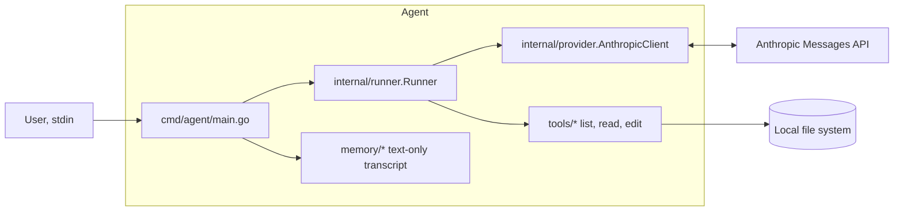

# Go Agent

A lean, extensible, language‑model–backed Go agent that can call simple tools to list, read, and edit files. Uses Anthropic’s Messages API by default.

## Current scope (alpha/experimental):

- Basic chat loop
- File tools: `list_files`, `read_file`, `edit_file`
- Persistence: minimal text‑only conversation history
- Provider: Anthropic Messages API (default)
- Model: `claude-3-7-sonnet-latest` (default; can be changed in internal/provider/anthropic.go)

### Tools

- `list_files`: Lists files in current directory (non-recursive); enforced by path validation and read denylist
- `read_file`: Reads a specified text file; enforced by path validation and read denylist
- `edit_file`: Creates or edits a file within the sandbox; enforced by path validation and write policy

## Quick start

### Setup:

- Go 1.24+

- Clone the repository:
```bash
git clone https://github.com/petasbytes/go-agent.git
cd go-agent
```

- Set API key:
```bash
export ANTHROPIC_API_KEY=sk-ant-...
```

### Run:

```bash
make run                               # or: go run ./cmd/agent
```

By default, the Makefile runs the agent from a dedicated `./sandbox` directory (via a subshell `cd`). This keeps file operations contained during development.

Note (development): The agent stores conversation state under `.agent/` in the current working directory (e.g., `sandbox/.agent/`). This directory is gitignored and can be safely deleted to reset state.

Optional: override sandbox roots (only if you aren't using the Makefile or want a different directory; by default the current working directory is used, and `make run` runs inside `./sandbox`):

```bash
export AGT_READ_ROOT="./my-workdir"
export AGT_WRITE_ROOT="./my-workdir"
make run
```

### Build:

```bash
make build                             # or: go build -o bin/agent ./cmd/agent
```

### Test:

```bash
make test                              # or: go test ./... -count=1
```
*(current testing scope: memory, registry, safety, tools)*

### Coverage:

```bash
make cover                             # or: go test ./... -count=1 -cover | tail -n 1
make cover-html                        # HTML report for local viewing
```

### Using the agent

The CLI starts an interactive session. Type natural language instructions; the agent may call file tools under the hood.

Example:

```
You: list the files in the current directory

Claude: Here are all the files and directories in the current directory:
- cmd/
- go.mod
- go.sum
- internal/
- memory/
- tools/
- README.md
- mysteriousotherfile.txt

Let me know if you need anything else!
```

```
You: create a new file called superimportantfile.txt

Claude: I'll create a new file called "superimportantfile.txt" for you.
Claude: I've successfully created the file "superimportantfile.txt"
```

```
You: please read the new file you just created

Claude: I'll read the superimportantfile.txt file for you.
Claude: Here's the content of superimportantfile.txt:
"This is a new super important file."
```

___

## Project layout

- `cmd/agent/` — CLI entrypoint and wiring
- `internal/provider/` — Anthropic client wrapper and `DefaultModel`
- `internal/runner/` — message send loop and tool dispatch
- `tools/` — `ToolDefinition`, JSON‑schema helper, and file tools
- `memory/` — JSON persistence for text‑only messages

## Architecture



### Current design choices

- Minimal, explicit tool registry (tools/registry.go)
- Text-only persistence for simplicity (memory/conversation.go)
- Centralised provider and model selection (internal/provider/)

## Safety

- File tools enforce sandboxed access via path validation and deny/policy rules.
- Sandbox roots:
  - `AGT_READ_ROOT` (default: current working directory)
  - `AGT_WRITE_ROOT` (default: same as read root)
- Path validation:
  - Clean + join relative paths
  - Symlink resolution (including deepest existing ancestor when the leaf doesn’t exist)
  - Robust boundary check using `filepath.Rel`
- Read denylist:
  - Denies reads under `.git/` and `.agent/` with code `ERR_DENIED_READ`
- Write policy:
  - Denies writes under `.git/` and `.agent/`
  - Denies `go.mod` and `go.sum` by filename at any depth
  - Violations return machine‑readable `ToolError` JSON (e.g., `{ "code": "ERR_DENIED_WRITE", ... }`)
- macOS note: paths under `/var/...` may resolve to `/private/var/...`; validators normalize roots to avoid false boundary failures.

- Defaults:
  - If `AGT_READ_ROOT`/`AGT_WRITE_ROOT` are unset, both default to the current working directory.
  - `make run` executes inside `./sandbox` (via subshell `cd`), so the effective roots default to `./sandbox`.

## Troubleshooting

- 401/403 from API: Ensure `ANTHROPIC_API_KEY` is set and valid.
- Network/proxy errors: Retry `make run` or check your proxy/firewall.
- 429 (rate limit): Wait and retry; this project is single-attempt by default (retries yet to be added).

---

## Roadmap

Planned:

- Pair-safe windowing and heuristic token counter
- Near-budget token counting; optional retries/limits

## Other references:

- Anthropic Messages: https://docs.anthropic.com/en/api/messages
- Tool use: https://docs.anthropic.com/en/docs/build-with-claude/tool-use

## License

See `LICENSE` in this repository.

## Acknowledgements

- Inspired by “How to Build an Agent” (AmpCode): https://ampcode.com/how-to-build-an-agent
- Portions of tools/edit_file.go were adapted from the article. Changes include package modularisation, input descriptions, tool definition and wiring.
